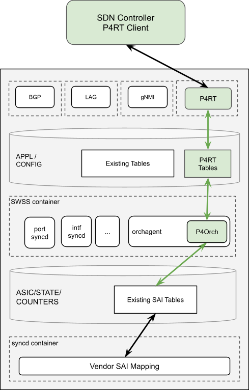
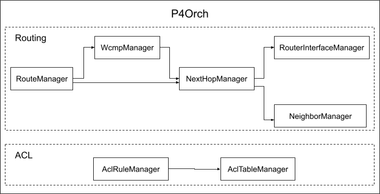

# P4 Orchagent

## Table of Content

* [Table of Content](#table-of-content)
* [Revision](#revision)
* [Scope](#scope)
* [Definitions/Abbreviations](#definitions-abbreviations)
* [Overview](#overview)
* [Requirements](#requirements)
  + [Functional Requirements](#functional-requirements)
* [High-Level Design](#high-level-design)
  + [P4RT Table](#p4rt-table)
  + [P4Orch Managers](#p4orch-managers)
  + [Centralized Mapper](#centralized-mapper)
  + [KeyGenerator](#keygenerator)
  + [P4Orch Interaction With Existing Orchagents](#p4orch-interaction-with-existing-orchagents)
  + [P4Orch To Application Response Path](#p4orch-to-application-response-path)
* [SAI API](#sai-api)
* [Configuration and management](#configuration-and-management)
* [Warmboot and Fastboot Design Impact](#warmboot-and-fastboot-design-impact)
* [Restrictions/Limitations](#restrictions-limitations)
* [Testing Requirements/Design](#testing-requirements-design)
  + [Unit Test](#unit-test)
  + [Pytest](#pytest)
* [Open/Action items - if any](#open-action-items---if-any)

## Revision

Rev  | Rev Date  | Author(s)                | Change Description
---- | --------- | ------------------------ | ------------------
v0.1 | 6/21/2021 | Runming Wu, Stephen Wang | Initial version

## Scope

This document describes the high-level design of the p4 orchagent in PINS. Refer to other supplementary documents for further details on particular features such as P4RT table schema and application response path.

## Definitions/Abbreviations

**PINS**: P4 Integrated Network Stack (PINS) is a project that provides additional components and changes to SONiC and allows the stack to be remotely controlled using P4 and P4Runtime.

**P4**: Programming Protocol-independent Packet Processors (P4) is a domain-specific language for network devices, specifying how data plane devices (switches, NICs, routers, filters, etc.) process packets

**P4RT**: P4Runtime (P4RT) is a control plane specification for controlling the data plane elements of a device defined or described by a P4 program.

## Overview

The P4RT application and the p4 orchagent (P4Orch) are the new components that PINS introduces into SONiC to support programming the switch through P4 language. The P4RT server application receives the P4 requests from the P4 client and converts them into APPL_DB P4RT table entries. The P4Orch is a new orchagent which lives inside the OrchAgent process and picks up the entries to make the corresponding SAI API calls to write to ASIC DB. For more information on PINS architecture design, please refer to the [PINS HLD](pins_hld.md) document.

This document is focused on the high level design of P4Orch. It behaves similar to other SONiC orchagents in the following ways:

* It is part of the orchagent process in the swss container.
* It handles its own APPL DB tables: P4RT table. Which is a group of APPL_DB tables with a common prefix.
* It uses sairedis library to invoke SAI API calls.
* It implements the common Orch virtual class and the necessary methods.
* It interacts with other orchs (portsorch, vrforch etc) for dependency information and reference counting.

However, to support the P4 & SDN requirements, there are some key differences between P4Orch and other SONiC Orchs:

* P4RT table in APPL DB uses a sub-table schema. Refer to the [P4RT APPL DB Schema](P4RT_App_DB_Schema.md) document for more information.
* Any programming request is meant to be executed synchronously at the time it arrives
    * All dependencies should have been satisfied by previous requests. Therefore retry is not required.
    * Requires confirmation from the SAI layer that the operation is completed.
    * The detailed result of the operation is returned to the application layer (P4RT application).

## Requirements

### Functional Requirements

* Process the request in P4RT tables and write them into ASIC DB. \
In SDN requirements, the controller must have full knowledge of the programming status in the SDN domain. PINS introduces P4 SDN support in SONiC with clear resource separation from the non-SDN domain:
    * A new application: P4RT application.
    * A new APPL DB table: P4RT table.
    * A new orch in orchagent: P4Orch.

    With resource separation, it clearly defines the ownership of objects created by the SDN controller or the rest of SONiC applications.

* Return the result of each request to the application. \
The existing SONiC orchagent does not support application layer response. However, this is a critical requirement in P4 SDN that the response must match the hardware programming status.

## High-Level Design

P4Orch is a new Orch class implementation added in the Orchagent process inside the SWSS container to handle the P4RT table entries.

### P4RT Table

This is a high level overview of the P4RT table. For more details, please refer to the [P4RT APPL DB Schema](P4RT_App_DB_Schema.md) document.

The P4RT table defines the P4 programming requests. The current schema is modeled from the below fixed SAI routing pipeline for the 2021-11 release.

The following are the sub-tables in P4RT table and their corresponding SAI object:

P4RT sub table                       | SAI object
------------------------------------ | ---------------------------------------
FIXED_ROUTER_INTERFACE_TABLE         | Router Interface
FIXED_NEIGHBOR_TABLE                 | Neighbor
FIXED_NEXTHOP_TABLE                  | Next Hop
FIXED_WCMP_GROUP_TABLE               | Next Hop Group Next Hop Group Member
FIXED_IPV4_TABLE FIXED_IPV6_TABLE | Route

The ACLs are modeled similarly to the existing AclOrch with a DEFINITION table that defines each ACL table and ACL_*ACL_TABLE_NAME* table to insert ACL rules to the tables.

### P4Orch Managers

To handle different sub-table in the P4RT table, the P4Orch is composed of multiple managers. Each P4Orch manager is responsible for handling one type of object. As they need to perform very similar actions, the ObjectManagerInterface virtual class is introduced to abstract the common functionalities.

The ObjectManagerInterface has the following methods:

* enqueue() : Insert the request into a manager's internal queue.
* drain() : Process all the requests in the internal queue.

During initialization, P4Orch creates a mapping between P4RT sub-tables and the managers.

The managers have the same dependencies as the modeled SAI pipeline shown above. The following diagram shows the dependencies between the managers.

The primary task of P4Orch upon receiving a batch of requests is to identify the object manager responsible for each request and call the manager's enqueue() method. At the end of the P4Orch::doTask() method, P4Orch will call each manager's drain() method in a fixed order to ensure appropriate dependency handling within the P4RT sub-tables. The following are the P4Orch managers planned for the 2021-11 release, ordered by the calling order(more managers might be added in the future):

* RouterInterfaceManager
* NeighborManager
* NexthopManager
* WcmpManager
* RouteManager
* AclTableManager
* AclRuleManager

The main request handling logic of each manager is in the drain() method. The general request processing paradigm is described below:

* Classify operation type into SET or DEL
* Deserialize and validate APPL DB request
* Process deserialized request
* Perform SAI calls via SAI Redis to program request into ASIC DB

Each manager locally maintains a map of the object information that is created/modified by the P4RT application. The map serves as an internal cache for all the successfully programmed entries. The keys of this map consist of the object ids used by P4RT application to identify the object and the corresponding entries represent the attributes of the object. The local map is used by each manager to take appropriate actions such as translating SET operation to create or modify operation while processing P4RT APPL DB requests.

### Centralized Mapper

The purpose of the centralized mapper is to store information that needs to be shared between various managers at a centralized location. This removes the need for managers to implement public methods that other managers can call and provides a consistent interface for sharing information between the managers. Therefore, the information stored by the centralized mapper is homogeneous. It stores the following information about all objects that are created by the P4RT application:

* P4RT object id
* SAI object id
* Object reference count

The above information is stored in a map with a key consisting of P4RT object id and entry consisting of SAI object id and object reference count for each object type.

The centralized mapper is used for the following purposes by the managers:

* Set/Get/Delete mapping between P4RT object id and SAI object id
* Validate whether a P4RT object id has been created by another manager
* Set/Get/Increment/Decrement reference count of a P4RT object id
* Get number of entries in the map for an object type

### KeyGenerator

The KeyGenerator is a common module to generate keys for all managers which are used in the managers’ local map and in the centralized mapper. The following are some example key formats:

* RouterInterfaceManager: router_interface_id=&lt;id>
* NeighborManager: router_interface_id=&lt;id>,neighbor_id=&lt;id>
* NextHopManager: next_hop_id=&lt;id>
* RouteManager: vrf_id=&lt;id>,ipv4_dst=&lt;id> or vrf_id=&lt;id>,ipv6_dst=&lt;id>

### P4Orch Interaction With Existing Orchagents

When a P4Orch manager needs information about the existing SONiC objects, it will interact with the existing orchs. Most existing orchs provide public methods and global pointers for other orchs to access the SONiC objects that they manage. The P4Orch managers interact with other orchs in the following manner:

* Query SONiC objects information, such as OID, existence etc.
* Increase the reference counting of a SONiC object when it is referenced in a P4RT object.
* Decrease the reference counting of a SONiC object when it is dereferenced from a P4RT object.
* Increase the resource counting in CrmOrch when a SAI object is created.
* Decrease the resource counting in CrmOrch when a SAI object is deleted.

In the initial release, P4Orch managers will interact with the following SONiC orchs:

* PortsOrch \
PortsOrch provides port information and port reference counting. P4Orch managers that require port information will interact with PortsOrch.
* VrfOrch \
VrfOrch provides VRF information and reference counting. Currently, only RouterInterfaceManager interacts with VrfOrch.
* CrmOrch \
CrmOrch provides resource management counting information. Several managers interact with CrmOrch for resource counting reference when doing SAI object creation and deletion.

Currently, public methods provided by P4Orch are limited. Existing SONiC orchs do not have full access to the P4RT objects.

### P4Orch To Application Response Path

As P4RT interface requires the response of each programming request to match the real hardware state, synchronous mode between orchagent and syncd are enabled so P4Orch can get the exact SAI API response. And P4Orch implements a notification channel to send the response further up to the P4RT application. For more details, please refer to the [APPL STATE DB & Response Path HLD](appl_state_db_response_path_hld.md) document.

## SAI API

N/A

## Configuration and management

N/A

## Warmboot and Fastboot Design Impact

Warmboot and fastboot support in P4Orch are being planned for the next phase (next SONiC release). In this phase, P4Orch does not support warmboot and fastboot features. There will be no impact on warmboot and fastboot of the existing orchs.

## Restrictions/Limitations

The P4Orch is designed to meet the SDN requirements. And hence there are some differences from the other SONiC orchagents:

* P4Orch requires the dependencies of each request to be satisfied by the previous requests. Any request with unsatisfied dependencies will be rejected.
* The P4RT table entry key is used to uniquely identify a request, the producer (P4RT app) must not modify the same request if the previous add/modify is not completed yet.
* P4Orch does not provide public methods for accessing its internal objects. Other existing orchs cannot refer to the P4RT table objects.

## Testing Requirements/Design

### Unit Test

A set of unit tests, using Google Test framework, is written to test the P4Orch:

* The unit tests take advantage of the mock and fake. They do not require DB dependency or other dependencies. They only test the functionalities of each P4Orch manager.
*  The unit tests include sanitizer testing:
    * AddressSanitizer
    * ThreadSanitizer
    * UndefinedBehaviorSanitizer
* The unit tests generate LCOV coverage reports. Reaching about 90% code coverage.

### Pytest

A set of pytest, using existing SONiC swss pytest framework, is written to test P4Orch at a more integrated level. The pytest runs in the sonic vs docker image that has DB and other sonic components. The pytest will generate requests in APPL DB and verify the entries written into ASIC DB. It also verifies the response channel and APPL STATE DB.

## Open/Action items - if any

N/A
